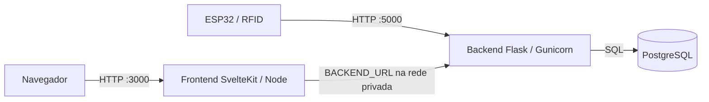
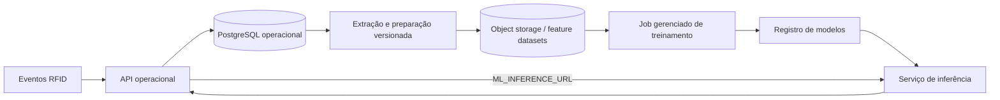

# Arquitetura de containers e evolução para machine learning

## Objetivo

Esta arquitetura separa o FabriTag em serviços implantáveis de forma
independente, sem antecipar um provedor de nuvem específico.

O contexto de negócio considerado é o de um armazém logístico multi-cliente.
A futura etapa de machine learning deverá prever demanda operacional,
principalmente:

- quantidade de lotes e produtos que devem chegar por período;
- demanda por SKU, cliente e câmara;
- ocupação futura e risco de lotação das câmaras;
- carga de recebimento, movimentação interna e expedição.

## Topologia atual



### Frontend

- Imagem: `docker/frontend/Dockerfile`.
- Runtime: Node.js com `@sveltejs/adapter-node`.
- Porta interna: `3000`.
- Publica a interface e funciona como gateway same-origin para `/api`.
- Resolve o backend por `BACKEND_URL`; o endereço privado não é incluído no
  JavaScript entregue ao navegador.

### Backend

- Imagem: `docker/backend/Dockerfile`.
- Runtime: Flask servido por Gunicorn.
- Porta interna: `5000`.
- Recebe chamadas do frontend e dos dispositivos RFID.
- Resolve o PostgreSQL exclusivamente por variáveis de ambiente.
- O endpoint `/api/status` verifica também a conectividade com o banco.

O Gunicorn usa um worker e múltiplas threads porque sessões autenticadas e
heartbeats dos dispositivos ainda são mantidos em memória. Antes de executar
mais de uma réplica do backend, esses estados deverão ser movidos para um
serviço compartilhado, como Redis ou PostgreSQL.

### PostgreSQL

- Imagem oficial `postgres:18-alpine`.
- Dados persistidos no volume `postgres_data_v18`.
- `schema.sql` é executado automaticamente somente quando o volume é criado.
- A porta do banco é publicada apenas em `127.0.0.1` no ambiente local.

Em nuvem, o banco deve ser substituído preferencialmente por PostgreSQL
gerenciado, com backups, conexão TLS, credenciais no secret manager e
migrações versionadas. O mecanismo `docker-entrypoint-initdb.d` não deve ser
usado como estratégia de migração de produção.

## Redes e contratos

O Compose cria duas redes:

- `edge`: comunicação entre frontend e backend;
- `data`: comunicação privada entre backend e banco.

O navegador usa somente caminhos `/api/...`. O frontend encaminha essas
requisições ao backend por meio da variável `BACKEND_URL`. Isso permite que o
mesmo artefato do frontend seja utilizado quando o backend mudar de endereço.

O backend continua com a porta publicada porque o firmware RFID precisa
alcançá-lo diretamente. Em nuvem, essa rota deverá ter endpoint próprio,
autenticação de dispositivo e TLS.

## Evolução proposta para ML em nuvem

O treinamento não deve ser incorporado ao container da API transacional. A
evolução recomendada é:



### Etapa 1 — dados confiáveis

Manter `MOVIMENTACAO_LOTE` e `MOVIMENTACAO_LOTE_PRODUTO` como fatos históricos
append-only. Criar uma transformação versionada para o dataset diário com, no
mínimo:

- data e atributos de calendário;
- cliente, SKU, produto e câmara;
- entradas, saídas e transferências;
- quantidade, peso e volume quando disponíveis;
- ocupação e capacidade da câmara;
- indicadores de sazonalidade e campanhas;
- variável-alvo e horizonte de previsão.

Dados sintéticos devem gerar eventos coerentes de chegada, permanência, saída
e transferência, e não linhas independentes. As distribuições e sementes do
gerador devem ser registradas junto à versão do dataset.

### Etapa 2 — treinamento desacoplado

Executar treinamento em jobs efêmeros, não no backend. O job deve:

1. ler um snapshot imutável do dataset;
2. dividir treino, validação e teste por tempo;
3. comparar baseline sazonal com modelos tabulares;
4. registrar métricas como MAE, RMSE e SMAPE;
5. publicar modelo, features, parâmetros e metadados no registro.

Modelos iniciais: baseline sazonal, regressão, Random Forest e Gradient
Boosting. Modelos temporais mais complexos só devem ser considerados após
validar volume e qualidade dos dados.

### Etapa 3 — inferência

Criar um serviço separado com contrato versionado, por exemplo:

```text
POST /v1/forecasts/warehouse-demand
```

Entradas mínimas:

- data/horizonte;
- cliente;
- SKU/produto;
- câmara;
- ocupação e histórico agregado.

Saídas mínimas:

- demanda prevista;
- intervalo de confiança;
- risco de lotação;
- versão do modelo e timestamp da previsão.

O backend operacional consumirá esse serviço por `ML_INFERENCE_URL`. Falhas do
ML não devem impedir cadastros, leituras RFID ou movimentações; a aplicação
deve degradar apenas a funcionalidade preditiva.

## Requisitos antes da produção em nuvem

- substituir sessões e heartbeats em memória por armazenamento compartilhado;
- introduzir migrações versionadas de banco;
- remover credenciais padrão e usar secret manager;
- ativar HTTPS e `COOKIE_SECURE=true`;
- restringir `CORS_ORIGINS`;
- autenticar dispositivos RFID;
- publicar frontend e backend como imagens independentes em um registry;
- adicionar logs estruturados, métricas e tracing;
- definir backup, retenção e política de dados;
- separar banco transacional de datasets e artefatos de ML;
- executar testes de integração e segurança no pipeline de CI/CD.
